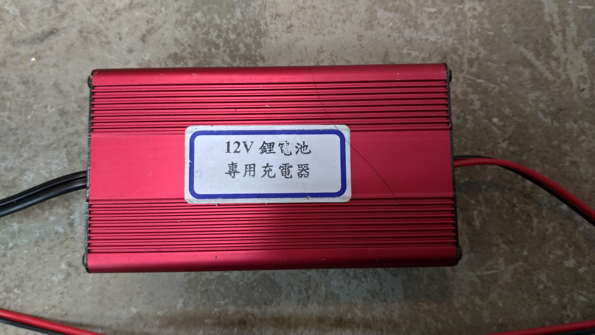
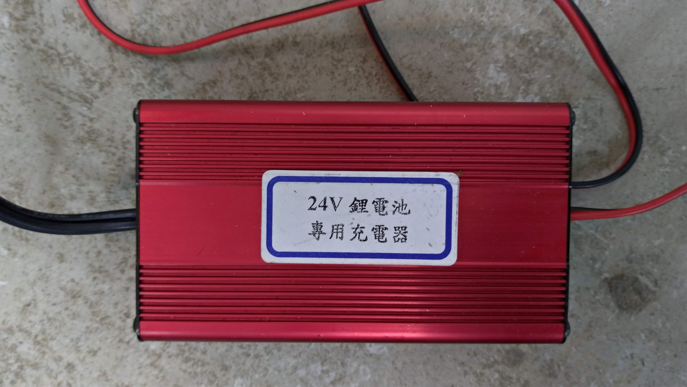

# Tracked Robot Document

This document describes the hardware configuration and basic operation of the robot.

> Recommand to read [ROS Tutorials](http://wiki.ros.org/ROS/Tutorials) chapter 1 before read this document

## Hardware

&uarr; Internal overview

- Main Control board (blue frame): [Udoo](https://www.udoo.org/)
  - OS: Ubuntu 16.04 for udoo
  - ROS Version: Kinetic
  - There are two Udoo: the top one is idle, the bottom one is main control board

- Ultrasonic sensor (yellow frame)
  - HC-SR04
  - 注意接頭有貼白色貼紙那面朝上, 牽線小心不要把超音波的排針弄壞

- Dynamixel (雲台馬達)
    - total 2 motors, one controls up & dowm, anothor controls left & right
    - It connect to Udoo via a micro USB

    

- Track motor
    - There are total four motors, two controls arm (arm motors), 2 controls moving (moving motors)
    - It connect to Udoo via a USB

- Dlink AP
    - SSID: EOY_AP
    - password: hscc54821

- For stair climbing function, you also need:
    - Nvidia TX2 (OS: Ubuntu 16.04 for TX2)
    - [ZED](https://www.stereolabs.com/)
        - on the dynamixel

### Battery
#### Four 12V battery
- There are total 4 12V batteries, 2 are idle now
    - one for Udoo and another for dynamixel
    - For dynamixel, you need an adapter to connect to the battery

#### Two 24V battery
- For track motors

#### One 110V battery (enerpad)
- For TX2, AP

> **NOTE**
> - 12V, 24V有專用充電器, 平均充2小時就會滿 (有指示燈), 兩個充電器皆無充滿自動斷電功能，所以盡量不要充過夜
>
>  
>
> 12V charger need the adapter (the same as the adapter for dynamixel) to connect to the battery

## Environment Setup
For Udoo, See [udoo_setup](udoo_setup.md)

## Start Up
### 1. Connect wires for track motors


&uarr;Wires for track motors (請抓著橘色頭插拔, 電線僅用熱縮管固定, 很脆弱)

### 2. 12V battery connect to Udoo
- Udoo will boot up when connected to the battery


> **WARN** Hub 只能打開有貼標籤的中間兩個開關, 其他開關必須關閉, 否則會造成 device name 跑掉而無法開啟馬達 !

### 3. 110V battery switch on

### 4. 蓋上上蓋, 鎖上鐵製支架
- 將鐵製平台 (內有TX2) 放上支架後在四邊鎖入十字螺絲固定
- 延長線, 雲台馬達的 micro USB及電池從機器人前方出線
- Udoo 網路線從機器人後方出線


&uarr; 鐵製支架 & 十字螺絲


&uarr; 上蓋完工圖 (紅框為螺絲鎖入處, 本圖尚未鎖入)

### 5. Connect micro USB & power supply to dynamixel
- 電源孔需要轉接頭, 平時插在 12V 電池上
- 此模組也可放在內部, 放在外部是為了出問題時方便斷電 reset

&larr;micro USB port for dynamixel (red frame), power input port (yellow frame)

### 6. Udoo connect to AP, then boot AP
- AP need 3-5 minutes to boot

### 7. Boot TX2 (if need)

### 8. turn on the switch on the rear of the robot, finish.

## Basic Operation
> Udoo ip: 192.168.0.197, username: udooer, password: udooer
>
> WIFI SSID: EOY_AP, password: hscc54821
### 1. ssh to Udoo
```bash
ssh udooer@<ip_address>
```

### 2. Open all motors (Track + Dynamixel)
```bash
roslaunch tracked_robot all_in_one.launch # press Ctrl+C to exit
```
- if launch successfully, you can see the model description of dynamixel and the string `Initialization is completed ...` from the cli output. If there are any error message, please check
    1. does every component be connected to its power and the battery is work fine ?
    2. Are all lines connected ?
    3. 雲台馬達的 device name 是否跑掉造成程式找不到 (正確為 `/dev/ttyUSB1`)
        - [udoo_setup](udoo_setup.md) 的 *Setup Dynamixel* 章節中有如何修改 launch 檔的教學

- 手臂建議在開啟/關閉前先斷電放平 (手臂會以 all_in_one.launch 開啟後所在角度作為座標 0)
- Dynamixel must be placed well before opening, otherwise the program may get an wrong origin coordinate for the dynamixel

#### Open Track motors only
```bash
rosrun tracked_robot Motor_node
```
#### Open dynamixel only
```bash
roslaunch my_dynamixel_workbench_tutorial position_control.launch
```

### 3. Open Manual control interface
```bash
rosrun tracked_robot Manual_node # press e to exit
```
- For moving / arm command, the robot will keep doing the action until the user enters the stop command.
- Don't press the keyboard too frequently, otherwise the command queue will be full and the new command will not execute in time
- 鍵盤按下後就會有反應, 不須一直壓著按鍵

#### Keyboard & Commands
#### Dynamixel (雲台馬達)
| Keyboard            | Command       |
| ------------------- | ------------- |
| 9                   | Init position |
| o                   | Up            |
| l (lower case of L) | Down          |
| i                   | Left          |
| p                   | Right         |

#### Track Motors
| Keyboard     | Command                                                                              |
| ------------ | ------------------------------------------------------------------------------------ |
| Up &uarr;    | Go forward                                                                           |
| Down &darr;  | Go back                                                                              |
| Left &larr;  | Spin left                                                                            |
| Right &rarr; | Spin right                                                                           |
| a            | Front arm up                                                                         |
| z            | Front arm down                                                                       |
| s            | Back arm up                                                                          |
| x            | Back arm down                                                                        |
| space        | Stop all motions (not include Dynamixel)                                             |
| r            | Set robot speed = 350, arm speed = 1000                                              |
| f            | Set robot speed = 1000, arm speed = 1000                                             |
| u            | Increase robot speed (increase 500 one time, up to 30000)                            |
| y            | Decrease robot speed (decrease 500 one time, down to 1000)                           |
| j            | Front & back arm raise up 90 degree (for initialize the angle of arms in the beginning) |

> **NOTE** If you can not control the robot, please check:
> 1. Caps lock is on (Manual_node accept lower case alphabet only)
> 2. If there are some error messages when launch all_in_one.launch
> 3. ssh connection and wifi is work or not
> - j 按鍵只能在開啟 all_in_one.launch (or rosrun Motor_node) 前手臂是平放狀態下才能按, 不然會轉過頭

## Developmant
- See [Development](development.md)

## Stair Climbing
- See [Stair Climbing](stair_climbing.md)
