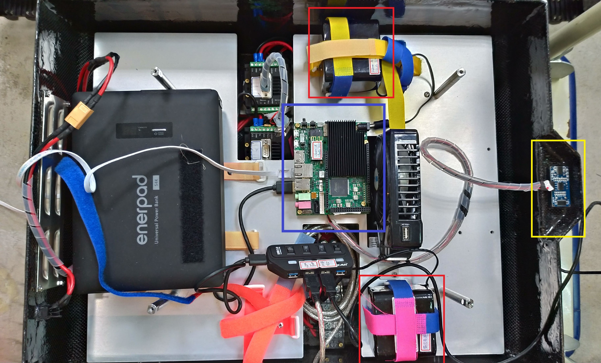
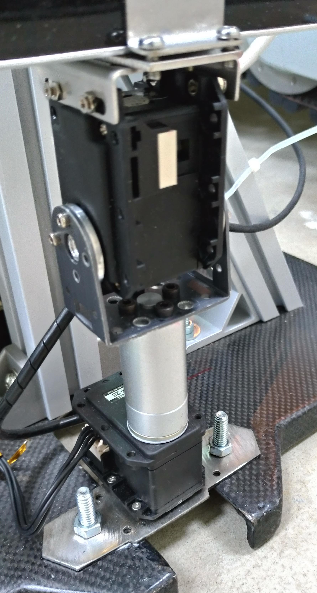
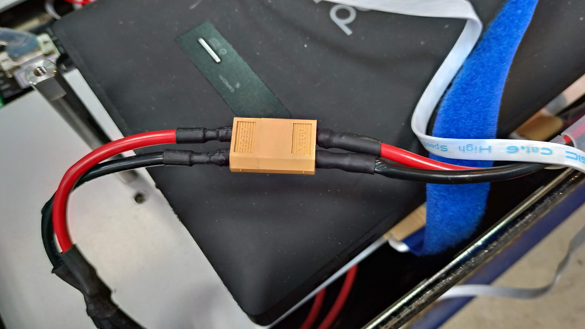
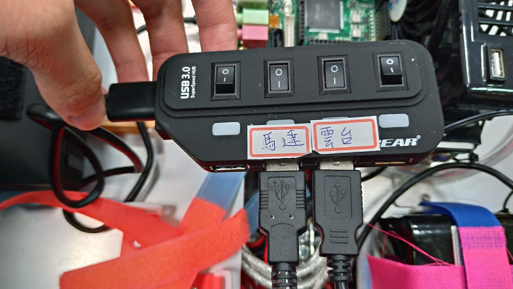
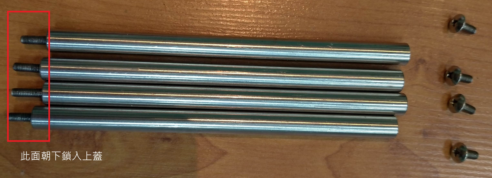
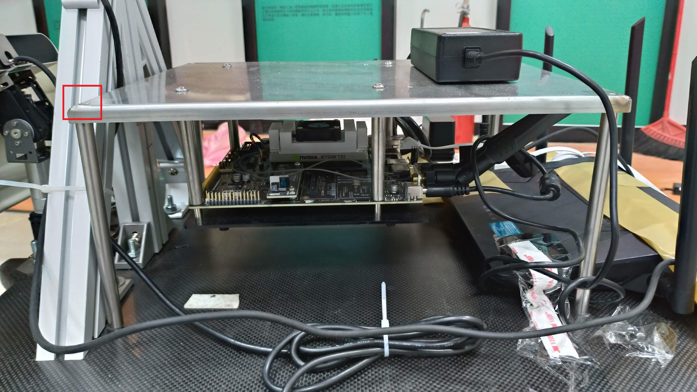
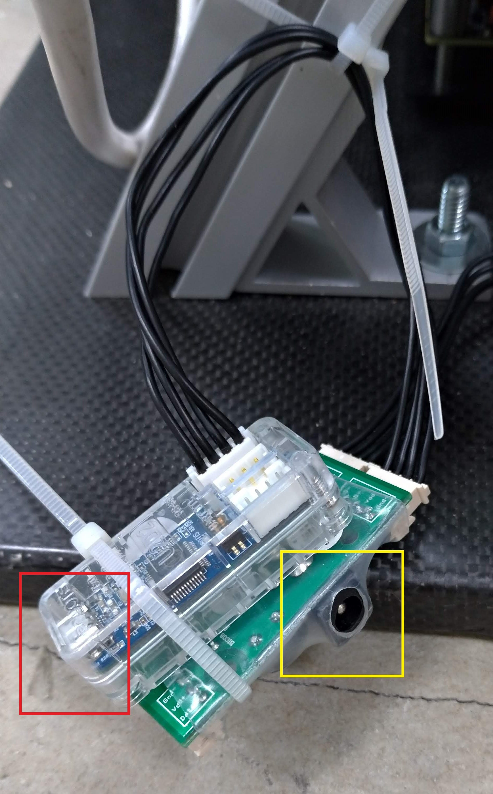

# 爬梯機器人使用手冊

本文件主要說明爬梯機器人的硬體配置及基本操作。

> 建議先閱讀 [ROS Tutorials](http://wiki.ros.org/ROS/Tutorials) 第一章, 才能理解指令及開發流程

## Hardware

&uarr; 內部零件

- 主控板(藍框): [Udoo](https://www.udoo.org/)
  - OS: Ubuntu 16.04 for udoo
  - ROS Version: Kinetic
  - 兩張疊一起, 上面那張閒置, 下面才是

- 超音波 sensor(黃框)
  - HC-SR04
  - 注意接頭有貼白色貼紙那面朝上, 牽線小心不要把超音波的排針弄壞

- 雲台馬達 (Dynamixel)
    - 共兩顆, 分別控制上下、左右
    - 放在機器人外部
    - 有一條 micro USB 傳輸線透過 USB Hub 連到 Udoo 上與之連線

    

- 履帶馬達
    - 共有四顆, 2顆控制手臂舉放, 2顆控制行走
    - 本文件將以手臂馬達、行走馬達分別稱之
    - 有一條 USB 透過 USB Hub 連到 Udoo 上與之連線

- Dlink AP
    - SSID: EOY_AP
    - password: hscc54821
    - 放在機器人外部

- 爬梯功能需要用到以下設備
    - Nvidia TX2 (OS: Ubuntu 16.04 for TX2)
        - 放在機器人外部
    - [ZED](https://www.stereolabs.com/)
        - 裝在雲台馬達上

### 供電
#### 4顆 12V 電池
- 供給 2 張 Udoo, 1台AP, 1個雲台馬達
    - 上方紅框供應 Udoo, 下方紅框供應雲台馬達
    - 目前 1 張 Udoo 閒置, AP 吃行動電源的電, 有 2 顆閒置電池
    - 雲台馬達需用轉接頭才能接上電池

#### 2顆 24V 電池
- 供給行走、手臂馬達

#### 1顆可供 110V 的行動電源(左方 enerpad)
- 供給 TX2, AP

> **NOTE**
> - 12V, 24V有專用充電器, 平均充2小時就會滿 (有指示燈), 兩個充電器皆無充滿自動斷電功能，所以盡量不要充過夜
>
>  
>
> - 12V專用充電器需使用轉接頭(規格同雲台馬達轉接頭)才能接上電池

## Environment Setup
For Udoo, See [udoo_setup](udoo_setup.md)

## 機器人開機
### 1. 履帶馬達電線接上


&uarr;履帶馬達電線 (請抓著橘色頭插拔, 電線僅用熱縮管固定, 很脆弱)

### 2. 12V 電源接上 Udoo
- Udoo 接上電源就會開機, 可看 USB Hub 有無亮燈判斷是否正常通電



> **WARN** Hub 只能打開有貼標籤的中間兩個開關, 其他開關必須關閉, 否則會造成 device name 跑掉而無法開啟馬達 !

### 3. 110V 行動電源開啟並接上

### 4. 蓋上上蓋, 鎖上鐵製支架
- 將鐵製平台 (內有TX2) 放上支架後在四邊鎖入十字螺絲固定
- 延長線, 雲台馬達的 micro USB及電池從機器人前方出線
- Udoo 網路線從機器人後方出線


&uarr; 鐵製支架 & 十字螺絲


&uarr; 上蓋完工圖 (紅框為螺絲鎖入處, 本圖尚未鎖入)

### 5. 接上雲台馬達之 micro USB & 電源
- 電源孔需要轉接頭, 平時插在 12V 電池上
- 此模組也可放在內部, 放在外部是為了出問題時方便斷電 reset

&larr;雲台馬達micro USB 接孔(紅框), 電源孔(黃框)

### 6. Udoo 網路線接上 AP, AP 接上電源開機
- Dlink AP 開機須等約 3 - 5 分鐘

### 7. TX2 開機 (如有用到)

### 8. 打開機器人後方之履帶馬達電源開關, 完成

## 基本操作指令
> Udoo ip: 192.168.0.197, username: udooer, password: udooer
>
> WIFI SSID: EOY_AP, password: hscc54821
### 1. ssh 進 Udoo
```bash
ssh udooer@<ip_address>
```

### 2. 開啟所有馬達 (履帶 + 雲台)
```bash
roslaunch tracked_robot all_in_one.launch # press Ctrl+C to exit
```
- 成功開啟會看到雲台馬達的型號敘述及 `Initialization is completed ...` 等輸出, 如有紅字輸出代表有錯誤, 請檢查
    1. 電源是否有電且開啟
    2. 線路有無脫落
    3. 雲台馬達的 device name 是否跑掉造成程式找不到 (正確為 `/dev/ttyUSB1`)
        - [udoo_setup](udoo_setup.md) 中有如何修改 launch 檔的教學

- 手臂建議在開啟/關閉前先斷電放平 (手臂會以 all_in_one.launch 開啟後所在角度作為座標 0)
- 雲台馬達開啟前務必擺正, 否則馬達的基準點有機會跑掉

#### 單獨開啟行走及手臂馬達
```bash
rosrun tracked_robot Motor_node
```
#### 單獨開啟雲台馬達
```bash
roslaunch my_dynamixel_workbench_tutorial position_control.launch
```

### 3. 開啟手動控制介面
```bash
rosrun tracked_robot Manual_node # press e to exit
```
- 因為機器人手臂改裝過, 因此開啟後請先按 r, 會設定合適的手臂抬起速度
- 鍵盤按下後就會有反應, 不須一直壓著按鍵
- 機器人會持續執行目前指令直到使用者輸入新指令 (雲台馬達則是每一次轉一固定角度後就停止)

#### 手動控制鍵盤對應
#### 雲台馬達
| 按鍵      | 指令         |
| --------- | ------------ |
| 9         | 回復初始位置 |
| o         | 上           |
| l (小寫L) | 下           |
| i         | 左           |
| p         | 右           |

#### 履帶馬達
| 按鍵         | 指令                                    |
| ------------ | --------------------------------------- |
| Up &uarr;    | 前                                      |
| Down &darr;  | 後                                      |
| Left &larr;  | 左                                      |
| Right &rarr; | 右                                      |
| a            | 前腳抬起                                |
| z            | 前腳放下                                |
| s            | 後腳抬起                                |
| x            | 後腳放下                                |
| space        | 停止所有動作 (不包含雲台馬達)           |
| r            | 設定行走速度 = 350, 手臂速度 = 1000     |
| f            | 設定行走速度 = 1000, 手臂速度 = 1000    |
| u            | 行走速度增加 (一次+500, 上限 30000)     |
| y            | 行走速度減少 (一次-500, 下限 1000)      |
| j            | 前後腳往上抬起 90 度 (用於一開始之手臂抬起) |

> **NOTE** 遇到無法控制情形時請檢查
> 1. 是否按到 caps lock (程式僅接受小寫字母)
> 2. all_in_one.launch 有無噴錯誤訊息導致馬達沒有正確開啟
> 3. ssh 是否斷線, wifi 是否正常
>
> - 指令不要連按, 否則可能會造成 command queue 塞滿導致新指令無法及時反應
> - j 按鍵只能在開啟 all_in_one.launch (or rosrun Motor_node) 前是平放狀態下才能按, 不然會轉過頭

## Developmant
- See [Development](development.md)
