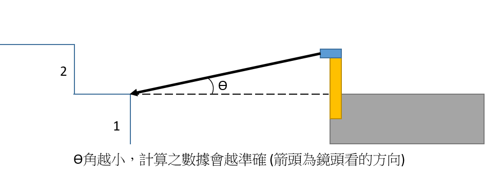
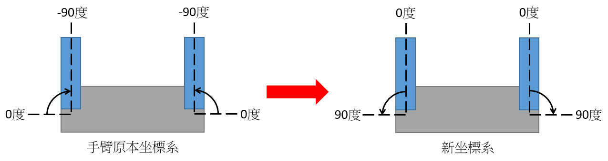

# 爬梯功能 (Stair climbing) 使用

## Command
### ssh to TX2
- TX2 ip: 192.168.0.150
- username: nvidia
- password: nvidia

```bash
ssh -X nvidia@<ip_address>           # ssh with x11-forwarding enabled
vncviewer nvidia@<ip_address>:<port> # use vnc to connect tx2
```
> **NOTE** 因為爬樓梯功能會需要看攝影機畫面來調參數, 故需要用 x11-forwarding (不看畫面就不需要 x11) 來取得視窗, 如是 windows 想要用 x11-forwarding 需要另外安裝軟體, 請自行 google. 也可使用 vnc viewer 連線 (port 5900)

### 1. set Udoo as ROS master
```bash
echo "ROS_MASTER_URI=http://<udoo ip>:11311" >> ~/.bashrc
source ~/.bashrc
```
- 此行指令僅須在換新版子時執行一次即可 (現有 TX2 可略過此步)

### 2. ssh to Udoo and open all_in_one.launch
```bash
roslaunch tracked_robot all_in_one.launch
```
> **NOTE** 一定要先開 Udoo 的 all_in_one.launch, roscore 才會在 Udoo 執行 (ros 定義執行 roscore 的板子為 master), 之後再打開 TX2 上的程式, TX2 會根據 ROS_MASTER_URI 尋找 master

### 3. Open stair_mark program
```bash
roslaunch stair_climbing stair_mark.launch
# 開啟 ZED 的 RGB 攝影機畫面
roslaunch stair_climbing stair_mark.launch rgb_imgshow:=True
# 開啟 ZED 的深度攝影機畫面
roslaunch stair_climbing stair_mark.launch depth_imgshow:=True
```
- `stair_mark.launch` 會做兩件事
    1. 執行 `zed_wrapper zed_camera.launch` 開啟 zed
    2. 開啟偵測樓梯程式

### 4. Start climbing
#### Climbing up
```bash
roslaunch stair_climbing up_stair.launch
```

#### Climbing down (need ultrasonic sensor)
```bash
# Open ultrasonic sensor in Udoo
rosrun tracked_robot ultrasonic
# Open down_stair.launch in TX2
roslaunch stair_climbing down_stair.launch
```

#### 上 + 下樓梯 (上樓梯後自動轉身下樓梯, Demo 用)
```bash
roslaunch stair_climbing Demo_stair.launch
```

## 爬樓梯流程
實際測試並調過參數的為 mode3, mode4, mode6, mode7
。mode21 與 mode5 因為較難調整, 當初是先略過

### 上樓梯
將過程分為三個 mode, 分別為 mode21 (對齊), mode3 (上第一階), mode4 (爬行+登頂)

#### *前置作業*
機器人前後臂舉起 90 度, 並開到樓梯面前(攝影機須可以看到樓梯)

#### mode21
1. 攝影機低頭 15 度 (以能平視第一階階梯為原則)


2. 機器人一邊前進, 一邊根據攝影機畫面進行左右身體微調以對正樓梯

3. 身體對正樓梯後, 機器人會往前直到合適的距離為止

#### mode3
1. 攝影機低頭 30 度 (以爬上階梯後能平視階梯的角度為原則)

2. 將手臂目前角度 (90度) 設為基準點 0 度 (之後敘述皆以新坐標系為準)


3. 前臂下放至 60 度, 放下後前臂應該要碰到第一階樓梯

4. 機器人往前, 此時機器人會慢慢爬上第一階 (接下來4, 5步機器人會一直往上爬)

5. 前後臂皆下放至 80 度, 此過程維持 4 秒, 此時可以看到機器人身體慢慢爬上階梯

6. 前臂下放至 95 度, 後臂下放至 110 度, 此時可以看到機器人後臂爬上階梯

7. 機器人停止

8. mode3結束, 此時應看到機器人已完全在階梯上

#### mode4 (包含登頂)
- 機器人一直往上爬, 並根據 d4 左右微調身體 (避免走歪), 同時檢查 counter21 確認是否快爬到階梯頂端了

- 若偵測到快爬到樓梯頂端, 會印出 `---Ready go to the top!---` 訊息

- 當出現兩次 `---Ready go to the top!---` 訊息時, 停止爬梯, 進入登頂階段

#### 登頂
1. 調整手臂與行走馬達的加速度

2. 機器人往上爬一小段, 使前臂逐漸上階梯表面, 接著停止

3. 攝影機回復原位

4. 前臂下放至 135 度, 後臂下放至 115 度, 往前走, 可看到機器人登上頂端

5. 前臂回至 60 度, 後臂回至 55 度, 此時可看到機器人逐漸將手臂回復至與地面平行

6. 完成登頂, 回復手臂

### 下樓梯
#### *前置作業*
開啟超音波 sensor, 前後臂舉起 90 度

#### mode5
1. 攝影機低頭 30 度
2. 與 mode21 做一樣的事

#### mode6
1. 向前走, 檢查超音波 sensor 資料 (機器人前端與地面距離), 若機器人前方距離地面 > 30 cm, 停下

2. 將手臂目前角度設為基準點 0 度 (接下來敘述皆以新坐標系為準)


3. 前臂下放至 135 度, 後臂下放至 60 度, 此時前臂會碰到階梯

4. 往前走, 在機器人下樓梯同時前臂回至 98 度, 後臂下放至 95 度, 接著停下

5. mode6 結束, 此時機器人全身在階梯上, 前後臂皆靠在階梯上

#### mode7 (包含著陸)
1. 攝影機低15度, 以看到階梯

2. 機器下樓梯, 同時檢查 d7 以確認身體有無歪掉, 若有歪掉則進行左右速度微調來調正

3. 下樓梯同時檢查 d (攝影機離地面距離), 若偵測 d > 750 三次, 則可確定機器人即將下玩樓梯, 此時進入著陸階段

#### 著陸
1. 機器人停下

2. 將手臂目前角度設為基準點 0 度

3. 機器人往前, 同時將後臂往上抬起至 90 度, 前臂不動 (此步驟約 5 - 7 秒)

4. 前臂往上抬起 90 度, 機器人繼續往前

5. 攝影機歸位, 結束

6. 完成下樓梯

## 調校、參數及關鍵變數說明
### Source code in TX2
```
~/catkin_ws/
  build/                                <- ros 編譯資料夾
  devel/                                <- ros 編譯資料夾
  src/
    stair_climbing/
      launch/
        Demo_stair.launch
        down_stair.launch
        up_stair.launch
        stair_mark.launch
      src/
        StairDet.h
        StairDet.cpp                    <- 樓梯偵測 function 實作
        Stair_Det.cpp                   <- 樓梯偵測主程式 (compile 後經由 stair_mark.launch 執行)
        UpStairMode.h
        UpStairMode.cpp                 <- 上樓梯 function 實作 (mode21, mode3, mode4)
        Up_Stair_Mode.cpp               <- 上樓梯主程式
        DownStairMode.h
        DownStairMode.cpp               <- 下樓梯 function 實作 (mode5, mode6, mode7)
        Down_Stair_Mode.cpp             <- 下樓梯主程式
        Demo_stairclimbing.cpp
      CMakeLists.txt
    zed-ros-wrapper/
      zed_wrapper/
        launch/
          zed.launch
          zed_camera.launch
    dynamixel-workbench/
    dynamixel-workbench-msgs/
    my_dynamixel_workbench_tutorial/
    CMakeLists.txt
```

### stair_mark.launch
- t1
    - 利用畫面中兩兩上下相鄰的 pixel 值, 彼此之間的深度差, 以找出物體的輪廓(edge) 線
    - t1 越小, 邊緣判定越寬鬆 (深度差不用很大就判定是 edge)
- t2

- t3
    - 決定樓梯寬度
    - t3 越大, 偵測到的edge線要越長才會被判定為樓梯的一階
- t4

- cnt_row

- rgb_imgshow
    - True: 打開攝影機 RGB 畫面 (需 ssh with x11-forwarding or vnc)

- depth_imgshow
    - True: 打開攝影機深度畫面 (需 ssh with x11-forwarding or vnc)

### up_stair.launch
- stop_align_dis
    - 當機器人距離階梯 <= stop_align_dis, 將不會再做左右對正的動作
    - 與 mode21 的 counter21 搭配使用

- far_dis
    - 當機器人距離階梯 > far_dis, 代表距離階梯太遠, 機器人會前進直到 `close_dis <= 機器人到階梯距離 <= far_dis`
    - 與 mode21 的 counter21 搭配使用

- close_dis
    - 當機器人距離階梯 < close_dis, 代表距離階梯太近, 機器人會後退直到 `close_dis <= 機器人到階梯距離 <= far_dis`
    - 與 mode21 的 counter21 搭配使用

- err
    - 攝影機會以計算出的樓梯中心點為畫面中心, 計算左右兩邊的深度差, 代表機器人左右有無對正
    - `深度差 < -err`, 表示機器人身體向右歪掉, 須向左調整
    - `深度差 > err`, 表示機器人身體向左歪掉, 須向右調整
    - 與 mode21 的 d21 搭配使用

### UpStairMode.cpp
#### mode21
- d21
    - d21 < -err, 表示機器人身體向右歪掉, 須向左調整
    - d21 > err, 表示機器人身體向左歪掉, 須向右調整
    - err 可根據實驗自由調整

- counter21
    - 攝影機與前方障礙物(階梯)的距離

#### mode4
- d4
    - 參數功能同 d21
    - err 為 56

- counter21
    - 攝影機與前方障礙物(階梯)的距離
    - 若偵測到 counter21 >= 臨界值 (預設 1500) 2次, 表示機器人即將爬到樓梯頂端

### DownStairMode.cpp
#### mode5
- d5
    - 參數功能同 d21
    - err 為 22

#### mode6
- us
    - 超音波 sensor 距離地面距離 (cm)
    - 若量到 us > 30, 表示機器人已走到階梯邊緣, 可準備下樓梯

#### mode7
- d7
    - 參數功能同 d21
    - err 為 51

- d
    - 攝影機距離地面的距離
